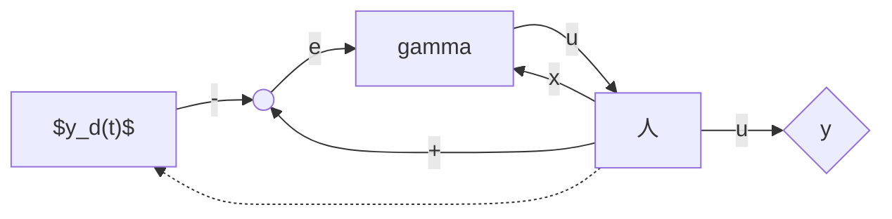

# terminology
A biped is an **open kinematic chain** consisting of two subchains called *legs* and often, a subchain called the *torso*, all connected at a common point called the *hip*

When only one leg is in contact wit the ground, the contacting leg is called the *stance leg*, the other is *swing leg*. End of the leg: *foot*

*single support phase*: *swing phase* counter part *double support*

**sagittal plane**: the longitudinal plane tht divides the body into right and left sections

**frontal plane**: the plane parallel to the long axis of the body and perpendicular to the sagittal plane. -> front and back portions

**transverse plane**: perpendicular to both

*planar biped*: biped with motions only in the sagittal plane

**statically stable gait**:  periodic locomotion in which the biped’s COM does notleavethe support polygon
**
quasi-statically stable gait** : where the center of pressure4 (CoP) of the biped’s stance foot remains strictly within the interior of the support polygon, and hence does not lie on the boundary. 

>Forces distributed along the base of the stance foot can be equivalently represented by a single force acting at the **center of pressure** (CoP). To be more precise, the CoP is defined as the point on the ground where the resultant of the ground-reaction force acts. In the legged robotics literature, the CoP is often referred to as the **ZMP**.

**fully actuated**, **underactuated**, **overactuated**:
- if single support and stance foot remains flat on the ground **Fully acutated**:
  - when the number of independent actuators equals the number of degrees of freedom
- if single support and stance foot rotate: **underactuated**
- if double support: **overactuated**

  
## Dynamics
**Assume singel stance, ideal pivot:**
the standard robot equations can be:
$$
D(q) \ddot{q}+C(q, \dot{q}) \dot{q}+G(q)=B u
$$
- **q**: gneralized coordinates
- **u**: actuator torques

**impact:**

when swing leg touches the walking surface

the walking suface:
- springy, 
  - like a trampoline, (蹦蹦床)
- viscous, 
  - like a muddy edge of a pond, 
- **rigid**, 
  - likea solid floor

impact -> a new initial condition
$$
x^{+}=\Delta\left(x^{-}\right)
$$

where $x^{+} :=\left(q^{+} ; \dot{q}^{+}\right)$

### A walking motion
A walking motion is then a periodic orbitin a hybrid model:
- 一个是连续的状态变化
- 一个是触地的状态突变
- 或者其它形态时的状态转换方程

>The **Poincar´e return map** is the appropriate mathematical tool for analyzing the stability of periodic orbits
>See Appendix B.3 for an informal treatment and Chapter 4 for a careful development of this mathematical tool.

## Challenges In controlling Bipedal Locomotion
- Limb coordination
  - Bipeds are typically high degree of freedom (DOF) mechanisms but the task of biped walking is inherently a low DOF task
  - when a problem admits many solutions, finding even one can be difficult
- Hybrid dynamics
  - A control theory for hybrid systems is just now being developed, and much of the current literature is devoted to equilibrium points instead of limit cycles.
- Effective underactuation
- Static instability
- Design of limit cycles
- Conservation of Angular momentum
  -  during the flight; leads to the impossibility of independently regulating the robot’s shape and absolute orientation during flight phases

> the robots studied in this book are assumed to have point feet with no actuation between the stance leg end and the ground,

## Control of Bipedal Locomtion
algorithms can be divided into two groups:
- time dependent
  - tracking the precomputed trajectories
- time invariant

The Block diagram of time dependent trajectory tracking controller
- gamma -> controller
- 人 -> plant
- y_d(t) -> the external trajectory planner

The block diagram of time-invariant controller

 the control action is “clocked” to events on the robot’s path and not to an externally supplied time-based trajectory. 

## Virtual Constraints
asymptotically impose *holonomic constraints* on a dynamic system through feedback control

**holonomic constraints** are relations between the position variables

When constraints are imposed on a system via feedback control, we call them *virtual constraints*

when designing virtual constraints, some care should be taken to account for the impacts. When impact happens, In general, there is no reason for the new initial condition to satisfy the virtual constraints
