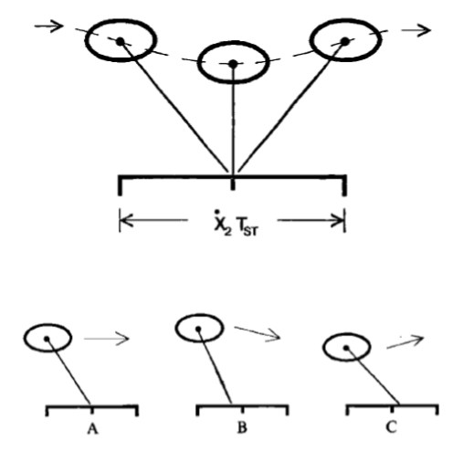
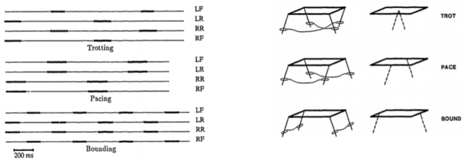
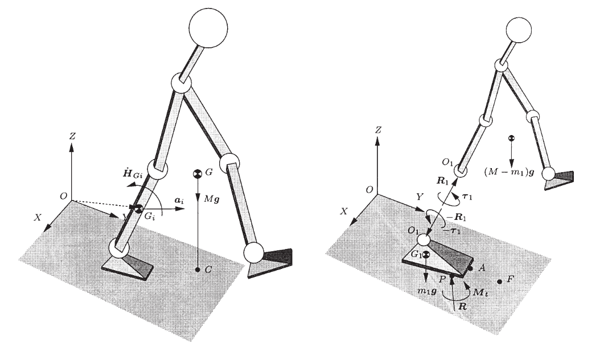
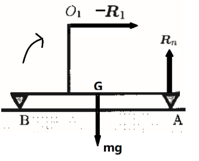

# CUE
- What is the function of forward velocity control in raibert control
  - what is the Nomial foot position? 
  - what is the feed back?
- How to calculate the body attitude controller
- How is the hopping height controled
- What is trotting, pacing, and Bounding?
- What is CoP, ZMP, FRI?
  - show that CoP and ZMP are equivalent from function
  - What is the difference between FRI and CoP?

> some pictures are captured from professor's slides
# Raibert Control
have three parts:
- forward velocity
- body attitude
- Hopping height

## forward velocity

$$
x_{F, d}=\frac{\dot{x} T_{S T}}{2}-K\left(\dot{x}-\dot{x}_{d}\right)
$$

The previous term $\frac{\dot{x} T_{S T}}{2}$ is the **Nominal Foot Position**,  No net acceleration.

The later term is to deal with the velocity error 

- Placing foot away from nominal produces acceleration 
- P controller

## body attitude 
control the pitch and roll axes
$$
\begin{array}{l}{f_{1}=K_{P}\left(\theta_{N}-\theta_{P, d}\right)+K_{V}\left(\dot{\theta}_{P}\right)} \\ {f_{2}=K_{P}\left(\theta_{R}-\theta_{R, d}\right)+K_{V}\left(\dot{\theta}_{R}\right)}\end{array}
$$

- It doesn’t have an actuator that twists about the leg axis. - But the system can still generate yaw torque. 
- However, the generated maximum yaw torque is not enough to control the facing direction.
## Hopping height
$$
\tau_{\text {spring}}=k_{p}\left(h_{\text {des}}^{\max }-h_{k-1}^{\max }\right)
$$

## Extend to 2-leg running
**"One foot Gait"**

- make a virtual leg, and switch the actual leg each step.
- mirror the other leg to keep the momentum

## Multileg 
- Coordinate all support legs so that they are active together
- Virtual-Leg

### Some notions

>further reading
>[http://agents.sci.brooklyn.cuny.edu/cc30.03/papers/p499-raibert.pdf]
>[https://www.researchgate.net/publication/235099450_Dynamically_Stable_Legged_Locomotion]

# FRI and ZMP control
> I did the presentation so I understand better

## Some Notions:

**GRF**: Ground reaction force

**CoP:** Center of Pressure
- Defined as the point P where the resultant R acts.
- $\boldsymbol{O} \boldsymbol{P}=\frac{\sum \boldsymbol{q}_{i} f_{n i}}{\sum f_{n i}}$

**ZMP:** zero momentum point
- The point where the **vertical** reaction force intersects the ground
- The point on the ground where the total **moment** generated due to gravity and **inertia equals zero**

**FRI:** Foot rotation indicator
- The point on the ground where the **Foot**'s **moment** generated due to gravity and body inertia **equals zero**

**GCoM:**  Ground Projection of Center of Mass 

## Some math:

The foundamental dynamics for foot and robot

**For the Whole Robot Body**

$$
\boldsymbol{M} +\boldsymbol{O} \boldsymbol{P} \times \boldsymbol{R}+\sum \boldsymbol{O} \boldsymbol{G}_{i} \times m_{i} \boldsymbol{g} =\sum \dot{\boldsymbol{H}}_{G i}+\sum \boldsymbol{O} \boldsymbol{G}_{i} \times m_{i} \boldsymbol{a}_{i} 
$$

**For the Foot on the ground**

$$
\boldsymbol{M}+\boldsymbol{O} \boldsymbol{P} \times \boldsymbol{R}+\boldsymbol{O} \boldsymbol{G}_{1} \times m_{1} \boldsymbol{g}-\boldsymbol{\tau}_{1} -\boldsymbol{O} \boldsymbol{O}_{1} \times \boldsymbol{R}_{1}=\dot{\boldsymbol{H}}_{G 1}+\boldsymbol{O} \boldsymbol{G}_{1} \times m_{1} \boldsymbol{a}_{1} 
$$

where 
- $M$, $R$ are torque and force from the ground.
- $H$ is the *angular momentum*
- $O$ is any point that we get the coordinate
- $P$ is the center of pressure
- $G_i$ is the center of mass
- $a_i$ is the accleration
- $\tau_1$ is the torque that acts on the joint of the first segment from the ground
- $R_1$ is the force that acts on the joint

Something to recap to understand these equation
- **力偶**
  - 大小: 力与力偶臂乘积， 方向...
  - 力偶只能用力偶来平衡，只有转动作用
  - **力偶对刚体任一点取矩都等于力偶矩， 不因矩心的改变而改变**
  - **力的平移定理**: 作用于刚体上的力，可以平移至刚体上任意点， 但是必须附加一力偶， 力偶矩等于原力对平移点之矩
    - 所以任何的作用都可以用一个力加一个力偶来表示
  - [resource](https://wenku.baidu.com/view/50d25e0103020740be1e650e52ea551810a6c9a1.html?qq-pf-to=pcqq.c2c)
- What the right-side is doing is just decompose the angular momentum about O to the time derivative of angular momentum about CoM + the angular momentum of the CoM in frame O
- $(.)_\tau$ means get the tengential direction (see later equations)

**The points that we are talking about are just the different selections of point O**

- select CoP -> $OP\times R = 0$
- select FRI -> $\left(\tau_{1}+F O_{1} \times R_{1}-F G_{1} \times m_{1} g\right)_{t}=0$ (definition)

### ZMP = CoP
from the equation:
$$
\boldsymbol{M} +\boldsymbol{O} \boldsymbol{P} \times \boldsymbol{R}+\sum \boldsymbol{O} \boldsymbol{G}_{i} \times m_{i} \boldsymbol{g} =\sum \dot{\boldsymbol{H}}_{G i}+\sum \boldsymbol{O} \boldsymbol{G}_{i} \times m_{i} \boldsymbol{a}_{i} 
$$
we get 
$$
\boldsymbol{M} +\boldsymbol{O} \boldsymbol{P} \times \boldsymbol{R}=-\sum \boldsymbol{O} \boldsymbol{G}_{i} \times m_{i} \boldsymbol{g} +\sum \dot{\boldsymbol{H}}_{G i}+\sum \boldsymbol{O} \boldsymbol{G}_{i} \times m_{i} \boldsymbol{a}_{i} 
$$
from the defn of ZMP, we get 
$$
[\boldsymbol{M}]_\tau  +\boldsymbol{O} \boldsymbol{P} \times \boldsymbol{R}=\left[ -\sum \boldsymbol{O} \boldsymbol{G}_{i} \times m_{i} \boldsymbol{g} +\sum \dot{\boldsymbol{H}}_{G i}+\sum \boldsymbol{O} \boldsymbol{G}_{i} \times m_{i} \boldsymbol{a}_{i} \right]_\tau 
$$
which means
$$
\boldsymbol{O} \boldsymbol{P} \times \boldsymbol{R} = 0
$$
denote the point O we chosed as D, thus $DP = 0$ and ZMP=CoP

### CoP and FRI
When CoP lies in the convex hull of foot(static stable)

we have

$$
\left(\tau_{1}+P O_{1} \times R_{1}-P G_{1} \times m_{1} g\right)_{t}=0
$$

But when it is not be stable(the foot is about to rotate), CoP can will be at the edge of the convex hull, and the above equation not hold.

We still find a point where this equation holds and denotes it as F(FRI)
$$
\left(\tau_{1}+F O_{1} \times R_{1}-F G_{1} \times m_{1} g\right)_{t}=0
$$

From previouse relationship 
$$
\boldsymbol{M}+\boldsymbol{O} \boldsymbol{P} \times \boldsymbol{R}+\boldsymbol{O} \boldsymbol{G}_{1} \times m_{1} \boldsymbol{g}-\boldsymbol{\tau}_{1} -\boldsymbol{O} \boldsymbol{O}_{1} \times \boldsymbol{R}_{1}=\dot{\boldsymbol{H}}_{G 1}+\boldsymbol{O} \boldsymbol{G}_{1} \times m_{1} \boldsymbol{a}_{1} 
$$

we have 
$$
\boldsymbol{M}+\boldsymbol{F} \boldsymbol{P} \times \boldsymbol{R}+
\underbrace{\boldsymbol{F} \boldsymbol{G}_{1} \times m_{1} \boldsymbol{g}-\boldsymbol{\tau}_{1} -\boldsymbol{F} \boldsymbol{O}_{1} \times \boldsymbol{R}_{1}}_{\text{this = 0}}
=\dot{\boldsymbol{H}}_{G 1}+\boldsymbol{F} \boldsymbol{G}_{1} \times m_{1} \boldsymbol{a}_{1} 
$$

get tengential, we have 
$$
\left[ \boldsymbol{F} \boldsymbol{P} \times \boldsymbol{R} \right]_\tau  = \left[ \dot{\boldsymbol{H}}_{G 1}+\boldsymbol{F} \boldsymbol{G}_{1} \times m_{1} \boldsymbol{a}_{1}  \right]_\tau 
$$

thus F and P will be coincide if 
$$
\begin{array}{l}{a_{1}=0 \text { and } \ddot{\theta}=0} \text{ :foot is stable} \\ {\boldsymbol{I}_{1}=\mathbf{0} \text { and } m_{1}=0} \\ {\boldsymbol{F} \boldsymbol{G}_{1} \| m_{1} \boldsymbol{a}_{1} \text { and } \boldsymbol{I}_{1}=\mathbf{0}}\end{array}
$$

## My example:

The foot is about to rotate, only have $R$ applied at the Joint

- CoP will stay at A
- FRI will move propotional with the scale of $R_1$