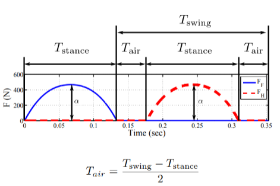

# CUE
- what are the three steps in contact force control?
- what is a wrench
- how to change the coordinate of a force.
- what technique is used to compute the ground reaction force and what trick is used to simplify the computation?
- How to transform the reaction force at the ground to the torque at the joints?
- what is MPC?
# contact force control
 
To control the movement of the CoM, we compute the contact force from the ground

generally three steps:
1. desired CoM wrench
2. generate contact force
3. compute joint torques to generate contact force

> 看到这三步，第一反应一定是使用$J^{T}$来最后求actuator的torque了，所以当时问了一个问题：**为什么我们不直接计算了第一步之后直接求CoM的$J^T$到第三步呢？**
> > 因为我们不过不求一下地面的反作用力的话，我们并不能知道我们这个系统整体受了多少的力，我们能够改变自己姿态的方式，只有通过外界来的力
## step1: compute the desired CoM wrench

**notion of wrench:**

$$
\left[\begin{array}c F \\ \tau  \end{array}\right]  \in  R^6
$$
to drive the $P_{\text{com}}$ to $P_{\text{com}}^{\text{des}}$

$$
f_{GA}^d = mg+f_{r}^d\\
f_{r}^{d} = - K_{p} (r_{c} - r_{c}^{d}) - K_{d}(\dot{r}_{c}- \dot{r}_{c}^{d}) 
$$

$$
\tau _{GA}^{d}  = R_{B} (\tau _{r} - D_{r}(\omega -\omega ^{d} ) )\\
\tau _{r} =-2(\delta I-\hat{\epsilon})K_{j} \epsilon 
$$

> this is xxxxxx controller

or we can have 
$$
\tau _{R,P,Y} = - K_{p} (\lambda - \lambda ^{des} ) - K_{d} (\dot{\lambda } - \dot{\lambda}^{des} )
$$

## step2: grasp map

$^oR_p$ Rotation matrix from p-frame to o-frame

$F$ contact force at $P$ in P-frame

represent $F$ by contact force and torque at $O$

$$
\left[\begin{array}c F_o \\ \tau _o \end{array}\right] 
 = \left[\begin{array}c ^{o} R_{p} F\\r\times ^{o} R_{p} F  \end{array}\right] 
 = \left[\begin{array}c ^{o} R_{p}  \\ \hat{r} \;^{o} R    _{p}  \end{array}\right] F
$$

the change of coordinate with $\tau$ is 

$$
W_{p}=A d_{o p}^{T}=\left(\begin{array}{cc}{^o{R_{p}}} & {0} \\ {\hat{r}_{p}^{o} R_{p}} & {o_{R_{p}}}\end{array}\right)
$$

### **grasp map $G$**
$$
F_{O}=\left[G_{1} \ldots G_{\eta}\right]\left[\begin{array}{c}{f_{1}} \\ {\vdots} \\ {f_{n}}\end{array}\right]
$$

$$
\boldsymbol{G}=\left(\begin{array}{ccc}{^o{\boldsymbol{R}_{P 1}}} & {\dots} & {^{o} \boldsymbol{R}_{\mathrm{p}_{\eta}}} \\ {\hat{\boldsymbol{r}}_{p_{1}}^{o} \boldsymbol{R}_{P 1}} & {\cdots} & {\hat{\boldsymbol{r}}_{\mathrm{Pn}}^{o} \boldsymbol{R}_{\mathrm{Pn}}}\end{array}\right)
$$

### **solve for the contact force**

one of the method is to use the generalized inverse

$$
F_{o} = GF_{c} 
\\
F_{c}  = G^{\dagger} F_{o} 
$$

**OR can use OPTIMIZATION mathod**

Note that if the friction constraint is a cone, then the problem is non-linear, so approximate it with *pyramid*, k-sided polyhedral convex cone. then it becomes linear.

then we can solve for this simple quadratic problem

## step 3 transform contact force to joint torque
virtual walk ftrans transform contact force to joint torque

$$
\tau _{\text{joints}} = J^TF_{c}  
$$

## application of this method

the MIT **cheetah** is using this techniques to control bounding

> paper: Quadruped Bounding Control with variable Duty cycle via vertical Impulse scaling

It has a *Force profile* to control the speed and bounded height.

The shape is kept and the length and height are variables

# MPC

use model to make predictions

control the whole sequence, LQR the whole sequence and take one step.

The difficulty met by MPC is CPU resource.