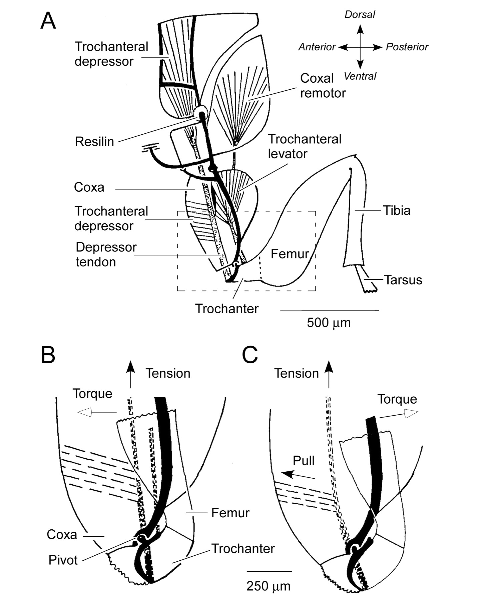

# CUE
- Consider the stance leg of your robot has a spring. How do you add the virtual constraint for the stance leg? 
- How to design the function of virtual constraint
- If the feedforward term is too complex to be computed in runtime, what do we do?
- How is the leg stiffness related to running/walking?
- Consider the Markov matrix with an absorbing failer state,
  - what is the first eigenvalue?
  - what is the second eigenvalue?
  - what is the third eigenvalue?
- what is the defn of the control lyapunov function?

# case study: Marbel

## the art of adding virtual constraint

Consider the stance leg of your robot has a spring. How do you add the virtual constraint for the stance leg? Constraint on the whole leg length or the motor length and let the spring free?

Constraint on only the motor length(and throw the dynamics of the prings into zero dynamics) is better. In this case the motor does not fight against the spring -> energy efficient.

## How to design the function of virtual constraint?

Handcraft some properties:
- lock the position of the motor at first to let the spring comply

And put the design work into optimization solver.

## The feedforward and computation power

Recall that the feedforward term has $L_{g}L_{f} h(x)$

This is too complex to be computed in runtime.

So can use the feedforward computed offline(based on the periodic orbit) instead. 

This leads to large torque ossilation when walking fast.(because the controller have error in tracking, and the feedforward is not that of the current state) 

Large toque ossilations will limit the gain that you could apply. (otherwise slip)

## How to run

Animal keep bouncing at the same height by changing the **active leg stiffness**.

Then we can use the motor and the spring to set the active leg stiffness. 

This leads to the moving a state into a higher layer controller rather than the inner controller of virtual constraints. (the stiffness) is not like all the other constraints: a function of the virutal angle.

> it reminds me of the leg structure of flea\
> 
> Flea's leg strucuture has a muscle to control the stiffness by streching on the perp direction. I remember that someone use a structure like this to plan the curve of the stifness(the total work is the same but the curve is not).

# metastable walking

Use markov chains to model the trainsition of states, adding an absorbing state representing falling down.

## Eigenvalues of the transition matrix

the first eigenvalue is 1

The second is related to the **Mean first-passage-time**

$$
M = \frac{1}{1-\lambda _{2} }
$$

The third is the time that the initial condition is forgotten

> when we have transition matrix then we can use things like value iteration.

## Control Lyapunov functions

review SISL:

review ES:

and the lyapunov functions corresponding to SISL, AS, ES

$\exist V(x) \qquad \text{s.t.}\quad$ 
1. $v(0) = 0$
2. $v(x) >0 \; x \neq 0$
3. $\dot{v}\leq 0$

**AS:** 1,2 and $\dot{v}<0$

**Es:** 1,2 and $\dot{v}(x)\leq - \gamma v(x)$

### **adding controller for it**

$$
\dot{v}(x) = \frac{\partial v }{\partial x }f(x,u)
$$

$V(x)$ is control lyapunov function if $\exist u \qquad \text{s.t.}\quad \dot{v}<0$

$V(x)$ is ES-CLF if $\dot{v}(x)\leq - \gamma v(x)$