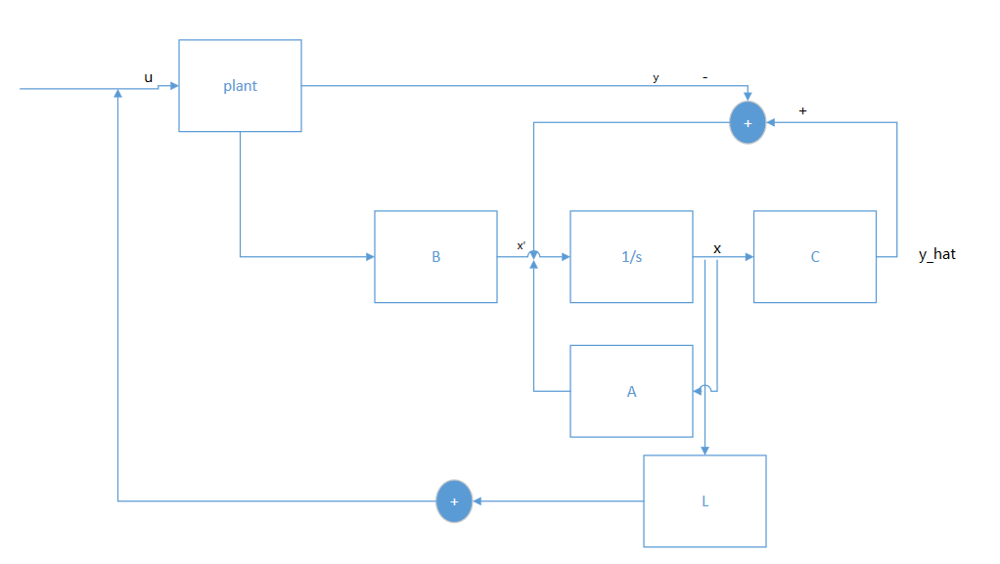

# CUE
- Write the system with state feedback
- use kalman decomposition to show how to set the e values of the controllable part
- What is the difference between the defn of controllable and stabilizable?
- Write the system of observer
- what is the defn of detectable
- what is the rule of thumb of design state feedback controller and observer?
- What is the separation principle?

> 老师之前玩squash后来后背伤了，coma，
> 老师今天膝盖疼疼醒了吃了止痛药，然后睡了，一会又疼醒了，忘了自己吃过，又吃了。“止痛药劲比较大,晕乎乎的”

> No lecture Tuesday next week

# state feedback

for a plant model
$$
\dot{x} = Ax +  Bu\\
y = Cx
$$

put a controller 
$$
u = Lx + v
$$

the system becomes $(A+BL)$,$B$,$C$,$0$

Last time, recap, using state feedback, we can assign the close-loop poles

## Thereom

For a system ABC0 that is controllable

**by choise of L, you can arbitrarily assign evalues of A+BL**

`L = place(A,B,[-2,-3,....,])`

> Note that it works with `A-BL` 

## for uncontrollable part

the uncontrolable part's eigen value you can do nothing about.

**Or to use kalman decomposition**

$$
\Sigma = \left[\begin{array}{cc|c}A_{11} & A_{12} & B_{1} 
\\
0 & A_{22} & 0 \\
\hline
C_{1} & C_{2} & 0
  \end{array}\right] 
$$

The $A+BL$'s becomes 
$$
\left[\begin{array}c A_{11} + B_{1} L_{1} & ? \\ 0  & A_{22}  \end{array}\right] 
$$
> Here the $?$ is some matrix but we don't care.

you can only set the eigenvalue of the upper left corner of the matrix

**Stabilizable** 

**Thm:** $\Sigma(ABCD)$ is called stabilizable if uncontrollale eigenvalues are stable(in last exmaple: $A_{22}$).

controllable $\Rightarrow$ stabilizable

# observer

> in the figure above, all the parts except the plant can be regarded as controller

I have a plant(ABCD), and a model of the plane. I simulate the states of the plant.

I take the $\hat{y}-y$ add a correction matrix $K$

make a plant model 
$$
\dot{\hat{x}} = A\hat{x}+ Bu + K(\hat{y}-y)\\
\hat{y} = C\hat{x}
$$

Your model and your sensors are all not perfect

> THOUGHT EXPERIMENTS\
> if you trust you model and your sensors are not accurate, K $\rightarrow$ 0.

Kalman filter chooses the optimal $K$ minimizing the error
> the only thing you design is K

## So the transfer function becomes

$$
\dot{\hat{x}} = A\hat{x}+ Bu + K(C\hat{x}-y)\\
\hat{y} = C\hat{x}
$$

the system becomes 
$$
\left[\begin{array}{c|c c} 
& u & y\\
A+KC B & B & -K\\
\hline
C & 0& 0
 \end{array}\right] 
$$

## How to design K

Suppose no modleing error, no noise no disturbance

look ant error's $e$ and $\dot{e}$

$$
\dot{e} = \dot{\hat{x}} - \dot{x} = (A+KC)\hat{x} + Bu - KCx - Ax -  Bu\\
= (A+KC)e
$$

So how to design observer, choose $A+KC$ to becomes stable. 

## How to use the matlab

Matlab works with $A-BL$, 

and note $\text{Spec}(A+KC) = \text{Spec}(A^{T}+C^{T} K^{T} )$

`K = place(A',-C',[evals])'`

use observer command `lsim`

## example in note

a boat

$$
m\ddot{q} + b\dot{q}= ku
$$

sensors 
$$
y = q + \text{noise}
$$

state of the boat
$[q,\dot{q}]$

> in the homework, you will find if you place poles at $-1,-1,-1$, you are relaying on the model ...

> [Extension] what if you know that your disturbance comes with certain frenequcies, How to nonlinear?

## Thm 

for a system $ABC0$

if $\Sigma$ is observable, then you can place $\text{Spec}(A+KC)$  whereever you like

if not observable, can only place Spec of the observable part

## defn: **detectable**

a system is called detecatable is the unobservable part is stable

$$
i.e. \exist K: (A+KC) \text{ is stable}
$$

### Example

I have a fifth order realization, eigen values $-2,-3,\pm j,4$

and $A+BL$ have eigen values $-2,-3,-1,-1,-1$

this is stablizable, we don't know whether this is controllable.

we will know it is controllable given another particular statefeedback changed the evalues $-2,-3$

阿波罗11有10KB的内存，and chips doing kalmen filters

# output feedback

put all the things together, plant, obs, L (not worry about $r$ command first)

observer:
$$
\dot{\hat{x}} = (A+KC)\hat{x}+ Bu - Ky\\
\hat{y} = C\hat{x}
$$
state feedback
$$
u = Lx+v
$$

the dynamics of the controller
$$
\dot{\hat{x}} = (A+KC+BL)\hat{x} + Bv - Ky
\\
u = L\hat{x} + v
$$

So the controller (ignore $v$)

$$
C = \left[\begin{array}{c|c}A+KC+BL & -K 
\\
\hline
L & 0
  \end{array}\right] 
$$

the rule of thumbs for The controller poles and observable poles

observable poles should be about 5 times of the controller poles

controller poles is decided by how you want the system to converge.

All of these are unnecessary if you do LQR, it does this choice of poles for you.

## seperation principle
It is okay to design the $L$ and $K$ separately

>it is not true for non-linear systems